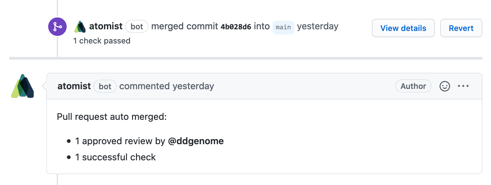

Never wait on someone to merge a pull requests again! With this skill you can
automatically merge pull requests on GitHub based on assigned labels. Required
reviews and checks settings configured in the repository on GitHub are used as
the rules for auto-merging.

This approach makes it easy for pull request authors (or anyone with permissions
in the repository) to flag a pull request for auto-merge, as well as set the
merge option, simply by adding a label. The merge option can also be set with a
label on the pull request.

When a new pull request is created, this skill will automatically apply the
default auto-merge policy and method labels (if set). The labels can be changed
on the pull request to modify the policy or merge method for auto-merge.

Opting out of auto-merge is a simple matter of removing the auto-merge labels
from a pull request.

Once the requirements for auto-merging have been met, the pull request will be
merged with the merge method defined for the pull request.

### Auto-merge behavior is managed using easily visible labels

For every new pull request raised, this skill automatically applies the relevant
labels to control the merge policy and merge method.

-   _Auto-merge policy labels_

    -   auto-merge:on-approve
    -   auto-merge:on-check-success
    -   auto-merge:on-bpr-success

-   _Auto-merge method labels_

    -   auto-merge-method:merge
    -   auto-merge-method:rebase
    -   auto-merge-method:squash

### Auto-merging after policy is satisfied

