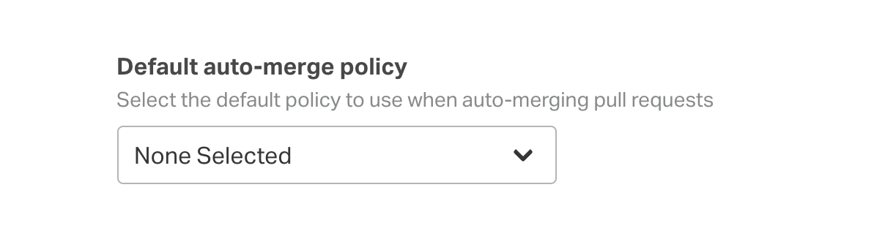
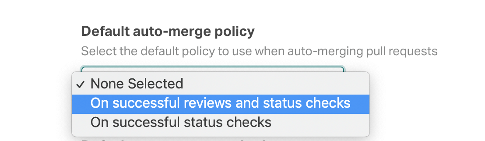
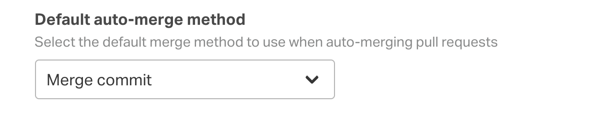
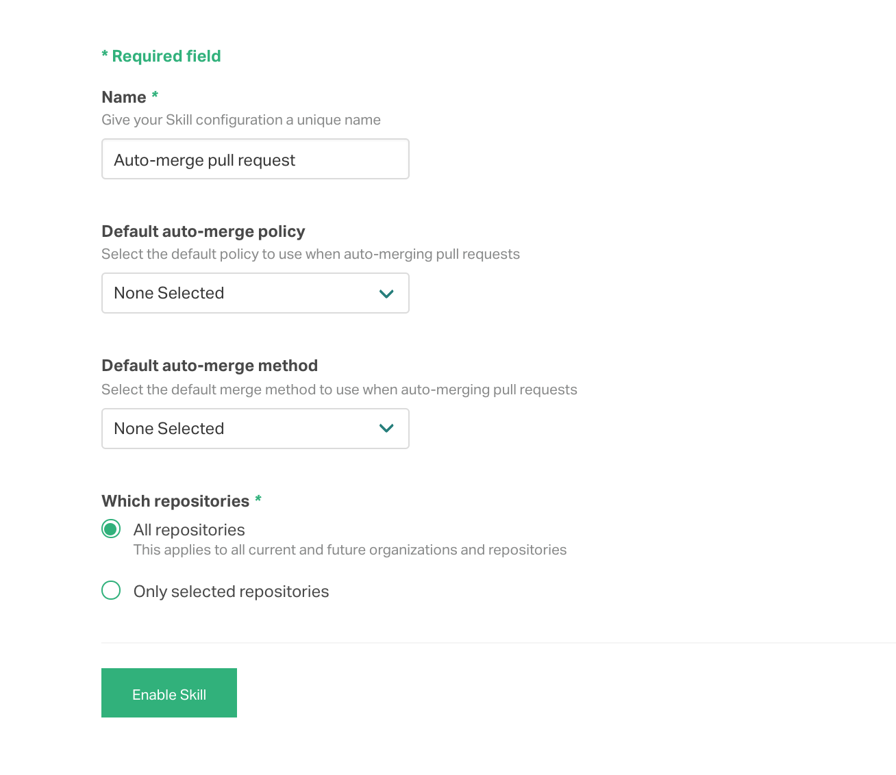

# `atomist/github-auto-merge-skill`

Automatically merge pull requests that pass all checks required to merge.

<!---atomist-skill-readme:start--->

# What it's useful for

With this skill you can automatically merge pull requests on GitHub based on assigned labels. Required reviews and 
checks settings configured in the repository on GitHub are used as the rules for auto-merging. 

This approach makes it easy for pull request authors (or anyone with permissions in the repository) to flag a pull 
request for auto-merge, as well as set the merge option, simply by adding a label. 

When a new pull request is created, this skill will automatically apply the default auto-merge policy and method labels
(if set). The labels can be changed on the pull request to modify the policy or merge method for auto-merge.

Opting out of auto-merge is a simple matter of removing the auto-merge labels from a pull request. 

Once the requirements for auto-merging have been met, the pull request will be merged with the merge method defined for
the pull request.

# Before you get started

Connect and configure these integrations:

1. **GitHub**
2. **Slack**

**GitHub** must be configured to use this skill. At least one repository must be selected. We recommend connecting the
**Slack** integration.

# How to configure

1. **Select the default policy to use when auto-merging pull requests**

    

    

    To do so when no explicit auto-merge label is applied to the pull request, you can select one of the options:

    - **On successful reviews and status checks** — Triggers auto-merge if all requested reviews are approved and all 
        commit status checks are green.
    - **On successful status checks** — Triggers auto-merge if all status checks are green.

    Note: there must be at least one [commit status check](https://developer.github.com/v3/repos/statuses/) in order for
    the auto-merge policy to be met. This skill supports [commit status checks](https://developer.github.com/v3/repos/statuses/);
    it does *not* currently support the [GitHub Checks API](https://developer.github.com/v3/checks/), so if your CI or
    build tool uses the Checks API, you will need to explicitly add a commit status update to your CI or build step in
    order for auto-merge to work. The work for supporting GitHub Checks is tracked in issue [#6](https://github.com/atomist-skills/github-auto-merge-skill/issues/6).

2. **Specify the default merge method by selecting a label**

    

    Select one of the these labels:

    - **Merge commit**
    - **Squash and merge**
    - **Rebase and merge**

3. **Determine repository scope**

    

    By default, this skill will be enabled for all repositories in all organizations you have connected.

    To restrict the organizations or specific repositories on which the skill will run, you can explicitly choose 
    organization(s) and repositories.

# How to use Pull Request auto-merging

1. **Configure skill, set default auto-merge policy and method** 

    

2. **For every new pull request raised, this skill will automatically apply the following labels when relevant:**

    **Auto-merge policy labels**

    - `auto-merge:on-approve`
    - `auto-merge:on-check-success`

    **Auto-merge method labels**

    - `auto-merge-method:merge`
    - `auto-merge-method:rebase`
    - `auto-merge-method:squash`

3. **Enjoy not having to ask if this pull request is ready to merge!**

    Note: the labels are automatically added to and removed from the repository depending on its settings. 
    For example, disabling the *rebase* merge method in the repository settings on GitHub will automatically remove 
    the label.

<!---atomist-skill-readme:end--->

---

Created by [Atomist][atomist].
Need Help?  [Join our Slack workspace][slack].

[atomist]: https://atomist.com/ (Atomist - How Teams Deliver Software)
[slack]: https://join.atomist.com/ (Atomist Community Slack) 
