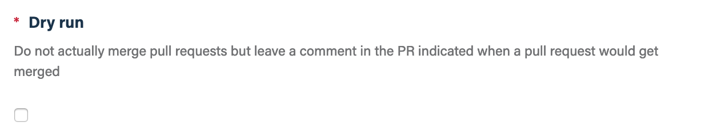
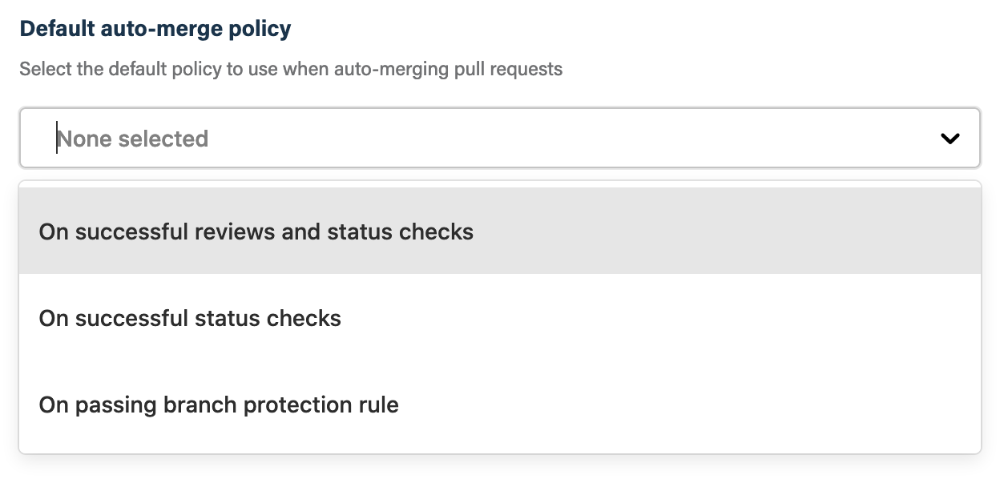
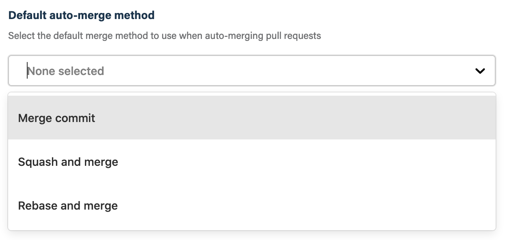
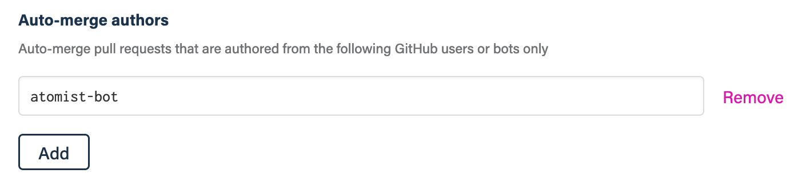

## Before you get started

Connect and configure these integrations:

1.  [**GitHub**](https://go.atomist.com/catalog/integration/github "GitHub Integration")
    _(required)_

## How to configure

1.  **Disable dry-run mode**

    

    By default, this skill will leave a comment on a PR that when it found one
    to auto-merge. This feature is intended for you to gain confidence with the
    skill and its configuration. Once you're happy with the configuration, you
    can disable dry-run and have this skill merge your pull requests for real.

2.  **Select the default policy to use when auto-merging pull requests**

    

    Select one of the auto-merge policies as the default. This can be changed
    for any pull request by changing the labels on the pull request.

    -   **On successful reviews and status checks** — Triggers auto-merge if all
        requested reviews are approved and all commit status checks are green.
    -   **On successful status checks** — Triggers auto-merge if all status
        checks are green.
    -   **On passing branch protection rule** — Trigger auto-merge if a GitHub
        branch protection rule passes

    Note: there must be at least one
    [commit status check](https://developer.github.com/v3/repos/statuses/) in
    order for the auto-merge policy to be met. This skill supports
    [commit status checks](https://developer.github.com/v3/repos/statuses/); and
    [GitHub Checks API](https://developer.github.com/v3/checks/) as well
    [GitHub Branch Protection Rules](https://docs.github.com/en/github/administering-a-repository/configuring-protected-branches).

3.  **Specify the default merge method**

    

    Select one of these methods:

    -   **Merge commit** — Create merge commit
    -   **Squash and merge** — Squash all branch commits and merge
    -   **Rebase and merge** — Rebase branch onto target branch and merge

4.  **Auto-merge pull requests from certain users only**

    

    This parameter lets you specify GitHub logins of users or bots from whom you
    want this skill to auto-merge pull requests. When this is configured, pull
    requests created by authors not in this list won't be auto-merged.

5.  **Determine repository scope**

    

    By default, this skill will be enabled for all repositories in all
    organizations you have connected.

    To restrict the organizations or specific repositories on which the skill
    will run, you can explicitly choose organizations and repositories.

6.  **Activate the skill**

    Save your configuration and activate the skill by clicking the "Enable
    skill" button.
